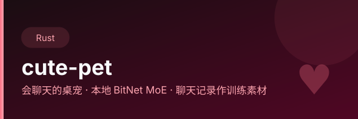

<div align="center">
  
</div>

# 制作一个桌宠的起因只是怀念心爱之人的说
- [ ] 微信与QQ聊天记录导出作为训练素材
- [ ] 本地Bitnet MOE 模型
- [ ] AI语音

> 🌐 **在线试玩（WebAssembly 版，无需安装）**：<https://lilyco-42.github.io/cute-pet/>
> 由 GitHub Pages 自动部署，源码与构建见 [`pages.yml`](.github/workflows/pages.yml)，每次 push 到 `main` 即重部署。

---

## 许可证与素材合规

**代码**：MIT，见 [LICENSE](LICENSE)。覆盖范围是本仓库自己写的代码；vendored
依赖、第三方素材、平台壳模板各有各的授权，不在这份 MIT 里。

**第三方内容清单**：见 [THIRD-PARTY-NOTICES.md](THIRD-PARTY-NOTICES.md)。

一句话摘要：

| 类别 | 许可 | 能不能跟着二进制分发 |
|---|---|---|
| `pet/vendor/macroquad-ply`、`miniquad-ply` | MIT OR Apache-2.0（文本已随仓库） | ✅ |
| `pet/vendor/quad-snd` | `MIT/Apache-2.0`，但上游无 LICENSE 文件 | ✅ 可，建议补一份回执 |
| `ply-engine`（crates.io） | 0BSD | ✅ |
| `pet/assets/font_wenkai.ttf`（霞鹜文楷） | SIL OFL 1.1，`font_wenkai-OFL.txt` 已随仓库 | ✅ 需同目录附带许可证文本 |
| `pet/assets/murasame_layers/*.png`（丛雨立绘分层，117 张） | ⚠️ **来源待确认** | ⚠️ 见下方说明 |

素材经 `rust-embed` 编进二进制，所以**发布二进制等于分发素材本身**。`murasame_layers/`
这一套是从视觉小说里提取的角色立绘分层图（`murasame_manifest.json` 的
`character` 字段写着 `ムラサメ`），默认状态是著作权保留 —— 在来源授权确认之前，
公开 Release 这一项标记为**未决**。`THIRD-PARTY-NOTICES.md` 里写了三种来源情形
对应的处理方式和代价，按实际情况回填即可。

---

## 开发

```bash
cd pet
cargo run                     # 桌面本机跑
cargo test --lib --bins       # CI lint job 的阻塞项也是这一条
```

鸿蒙交叉编译需要本机 SDK，先生成 cargo 配置（不进仓库）：

```bash
OHOS_SDK_NATIVE=<sdk>/default/openharmony/native ./tools/setup-ohos-cargo-config.sh
```

详见 [pet/docs/harmonyos-rust.md](pet/docs/harmonyos-rust.md)。CI 不走这条路，
harmony job 用 `RUSTFLAGS` 覆盖（`pet/.cargo/config.toml` 里刻意不写死 SDK 路径）。

构建矩阵与产物见 [docs/CI_BUILD.md](docs/CI_BUILD.md)。

## Web 试玩（GitHub Pages）

仓库自带浏览器版：<https://lilyco-42.github.io/cute-pet/>。它由
[`.github/workflows/pages.yml`](.github/workflows/pages.yml) 在每次 push 到 `main` 时，
把 `cargo build --target wasm32-unknown-unknown --profile release-wasm` 的产物
（`app.wasm`）+ ply-engine 官方 web 引导包（`pages/ply_bundle.js`，内含
miniquad `gl.js` / `macroquad_audio` / `sapp_jsutils` / `ply_net` / `ply_storage` /
无障碍）+ 引导页（`pages/index.html`）组装成静态站点部署。

> ⚠️ 引导 JS 必须用 `ply_bundle.js`，**不要换回裸 `gl.js`**。`pet/.cargo/config.toml`
> 用 `--import-undefined` 刻意保留未定义导入；缺实现时 `gl.js` 会把它们装成
> "缺失函数桩"，而那个桩**每次被调用都 `console.warn`**。`audio_*` / `ply_a11y_*`
> 每帧都会调 → 实测约 4400 条警告/秒，DevTools 与主线程一起被拖垮。

本地起一个等价预览（需先 build wasm）：

```bash
cd pet && cargo build --target wasm32-unknown-unknown --profile release-wasm
mkdir -p /tmp/cp-demo && cp target/wasm32-unknown-unknown/release-wasm/cute-pet.wasm /tmp/cp-demo/app.wasm
cp ../pages/ply_bundle.js /tmp/cp-demo/ply_bundle.js
cp ../pages/index.html /tmp/cp-demo/index.html
python -m http.server -d /tmp/cp-demo 8080   # 浏览器开 http://localhost:8080
```

> 另：浏览器版同样内嵌了 §2.2 提到的丛雨立绘素材，来源确认前它依旧随 demo 公开。
